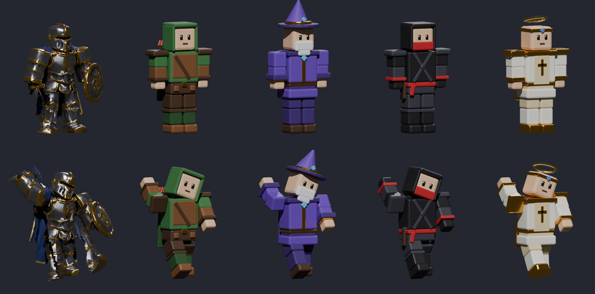
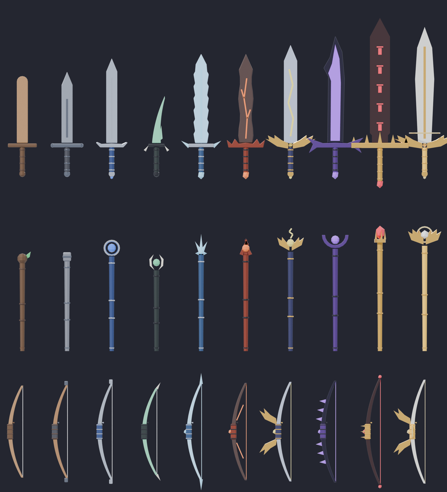
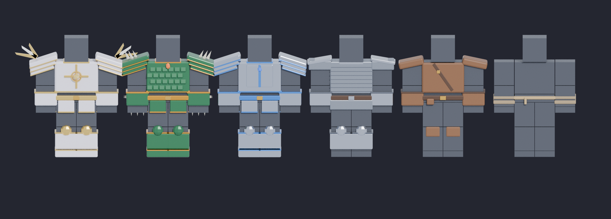

# Arena Ascend

A Roblox action RPG built from scratch in Luau. Pick a class, level up, shape
your build with attribute points, ability ranks and a branching talent tree,
fight other players in the Pit, team up to take on the Wilds and its boss, and
spend what you earn on elite gear and custom outfits in the Armory.

The whole map is built from code, so it runs in an empty Baseplate place with
no uploaded assets.

## Play it in Studio

1. Install [Rojo](https://rojo.space) (the VS Code extension or the CLI) and the Rojo Studio plugin.
2. From this folder run `rojo serve`, open a new **Baseplate** place in Roblox Studio, and click **Connect** in the Rojo plugin.
   (Or run `rojo build -o ArenaAscend.rbxl` and open the file.)
3. To keep progress between sessions, publish the place and turn on
   **Game Settings > Security > Enable Studio Access to API Services**. Without it the game still runs; progress just isn't saved.
4. Press **Play**. For PvP and party testing, use **Test > Clients and Servers** with 2–4 players.

## Controls

| Input | Action |
| --- | --- |
| Click / tap | Basic attack (swing, arrow or bolt, depending on class) |
| Q E R F | Abilities 1–4 (gamepad: X, Y, L1, R1; touch: tap the slot) |
| C | Hero menu: attributes, abilities, talents |
| B | Armory (shop) |
| P | Party menu |
| G | Open the Armory at the kiosk |

## Classes

| Class | Role | Weapon | Abilities | Specializations (level 10) |
| --- | --- | --- | --- | --- |
| Knight | Frontline tank | Blade | Shield Bash, Whirlwind, Rallying Cry | Guardian (Bulwark) or Berserker (Bloodrage) |
| Ranger | Ranged marksman | Bow | Piercing Shot, Tumble, Arrow Rain | Sharpshooter (Deadeye) or Trapper (Snare Field) |
| Mage | Spell artillery | Staff | Fireball, Frost Nova, Blink | Pyromancer (Meteor) or Frostweaver (Blizzard) |
| Rogue | Burst assassin | Blade | Shadowstep, Fan of Knives, Evasion | Assassin (Death Mark) or Shadowdancer (Blade Flurry) |
| Cleric | Healer and support | Staff | Smite, Mend, Sanctuary | Templar (Judgment) or Oracle (Divine Hymn) |

Each class has its own base stats and growth, health pool, move speed,
basic attack, starter outfit (cape or hood in class colours) and weapon look.
Every weapon in the Armory turns into a staff or bow for classes that use one.

## Character development

- **Attribute points**: 3 per level. Spend them on Strength (physical damage), Intellect (spell damage, healing), Vitality (health, defense) or Agility (crit, attack speed, move speed).
- **Skill points**: 1 per level, plus 1 bonus every 5 levels. Spend them on ability ranks or talents.
- **Ability ranks**: up to rank 5. Each rank adds 15% power and cuts 5% off the cooldown. Each rank needs 4 more levels than the one before it, so points can't all go into one ability early.
- **Talent tree**:
  - A Core branch every class shares: Toughness, Precision, Haste, Fortune, Wisdom.
  - Two specialization branches per class. Learning one at level 10 unlocks its ultimate and locks the other branch.
  - Inside a branch, the level-15 talents are pick-one-of-two, followed by a level-25 capstone. Two players with the same class and spec can still end up with different builds.
- **Respec** is free below level 10, then costs coins. Changing class keeps your level and gear and refunds all points (free below level 5).

All stat math lives in `src/shared/Stats.lua`, and the client and server both use it. The Hero menu shows exactly the numbers the server applies.

## World

- **Plaza** (safe zone): spawns and the Armory kiosk. No PvP here.
- **The Pit**: the PvP arena, with cover pillars and King's Hill. Kill streaks put a coin bounty on your head.
- **Training Grounds**: dummies (Straw, Iron, Golem) and coin crystals for solo grinding.
- **The Wilds** (PvE, levels 5–30): Goblin Raiders, Skeleton Archers, Orc Brutes, and the **Ashen Warlord** boss on the altar. The boss telegraphs slams, respawns every 3 minutes, and drops Legendary/Mythic gear and the loot-only Ashen Crown outfit.

## Parties

- Up to 4 players. Invite from the Party menu (P).
- No friendly fire. Party heals and buffs (Mend, Rallying Cry, Sanctuary and others) affect your teammates.
- **XP and coins are shared** between members within 150 studs of a kill. The group gets +25% total rewards for each extra member present.
- **Loot is personal**: every nearby member gets their own drop roll. Duplicate drops are salvaged for coins.
- Teammates get an outline in your party's colour. PvP between different parties works anywhere outside the Plaza, so team-vs-team fights happen in the Pit or out in the Wilds.

## Armory and premium

- **Coins** come from kills, dummies, mobs, crystals and levelling up. They buy weapons, armor and outfits (Common to Mythic, each with a level requirement).
- **Gems** are the premium currency (Robux gem packs). They buy premium cosmetic outfits only.
- **Starter kits** (Robux, one-time): a Rare or Epic weapon, armor, an exclusive outfit, and coins/gems.

Fairness rules:
- Anything that raises combat stats can also be earned by playing.
- Gear from kits and loot keeps its level requirement to equip.
- Gems never buy XP, stat points or power.

### Setting up products

1. Creator Dashboard > your experience > **Monetization > Developer Products**: create one product per entry in `src/shared/Products.lua`.
2. Paste each product ID into its `ProductId` field.

Products left at `0` still show in the shop but won't open a purchase prompt. Receipts are handled in `PremiumService`: a purchase is confirmed only after it saves, and receipt IDs are stored so a purchase is never granted twice.

## Class models

Each class has a stylized, rigged signature model:



| File | Use |
| --- | --- |
| `assets/models/<Class>.glb` | Import into the game. Holds 15 meshes named after the R15 body parts (plus an invisible `HumanoidRootPart`). |
| `assets/models/rigged/<Class>_Rigged.glb` | The same model skinned to a 17-bone R15 skeleton, for Blender, Moon Animator or avatar work. |

The Knight is your Meshy model: optimized to 16k triangles, cut at the joints into
R15 parts, with its sword blade removed so the equipped weapon shows instead. The
Ranger, Mage, Rogue and Cleric are generated in the same blocky style. Rebuild
them all with `tools/build_class_models.py` (Blender 4.2 Python):
`python build_class_models.py -- <out dir> <optimized Meshy knight .glb>`.

### Installing them

1. In Studio, **File > Import 3D** and choose each `assets/models/<Class>.glb`.
   Keep the default settings and don't rotate the result.
2. Create folders **ReplicatedStorage > Assets > ClassModels**. Move each imported model
   in and rename it to its class Id: `Knight`, `Ranger`, `Mage`, `Rogue`, `Cleric`.
3. Press Play. Players wearing their class's signature outfit (the free class outfit,
   equipped automatically when they pick the class) become that model.

### How it works in game

- `ClassModelService` swaps the player's 15 body parts for the model's parts with
  `Humanoid:ReplaceBodyPartR15`. It then rebuilds the R15 Motor6D joints from
  `Shared/ClassRigs.lua`, which holds the joint positions exported by the build script.
- Roblox's default walk, run, jump, climb and tool-slash animations all play on it.
  Hitboxes, abilities and weapons work as usual.
- Switching to any other outfit in the Armory restores the player's own avatar, hats
  included. Armor plates and outfit extras are hidden while a signature model is worn;
  their stats still apply.
- A model that isn't split into R15 parts, such as a single-mesh import, still works.
  It is welded on as a static costume that moves but doesn't animate its limbs.
  Optional attributes: `Height` (studs, default 5.6) and `Yaw` (degrees, default 0).

## Equipment models

Every weapon in all three class styles (blade, staff, bow) and every armor set
has a stylized model (previews rendered in Blender):





| File | Contents |
| --- | --- |
| `assets/models/Weapons.glb` | 30 meshes named `<WeaponId>_<Blade/Staff/Bow>`, e.g. `Frostbite_Staff` |
| `assets/models/Armor.glb` | 51 meshes named `<ArmorId>_<R15 body part>`, e.g. `KnightPlate_LeftUpperArm` |

Armor is split per body part, so each piece moves with its limb. Pieces are
modelled around Roblox's default blocky R15 body and stretched at runtime to fit
whatever body wears them: players' avatars, class models, mobs, and shop mannequins.
Rebuild with `tools/build_item_models.py` (Blender 4.2 Python):
`python build_item_models.py -- <out dir>`.

### Installing them

1. In Studio, **File > Import 3D** and choose `assets/models/Weapons.glb`, then `Armor.glb`.
2. Move the two imported models into **ReplicatedStorage > Assets**, named `Weapons`
   and `Armor`. Keep the mesh names the importer gives them.
3. Press Play. Tools, mobs and shop previews all use the new models. `Shared/ItemRigs.lua`
   (generated by the build script) says how big each mesh is and where it's held or worn,
   so the import scale doesn't matter.

Anything not installed falls back to the part-built look, so the game runs either way.

## Code map

```
src/shared/            (ReplicatedStorage.Shared)
  Classes.lua          classes, base stats, specializations
  Abilities.lua        every ability as data (Kind + numbers), rank scaling
  Talents.lua          talent trees, requirements and exclusive choices
  Stats.lua            profile -> combat numbers (used by server and UI)
  Items.lua            weapons, armor, outfits; staff/bow names
  Products.lua         Robux gem packs and starter kits
  Levels.lua           XP curve, point budgets, rewards, respec costs
  Visuals.lua          builds weapons/armor/outfits (imported models or parts)
  ItemRigs.lua         sizes, grips and offsets for the equipment models (generated)
  ClassRigs.lua        joint positions for the class models (generated)
  Remotes.lua, Zones.lua, Format.lua
src/server/            (ServerScriptService.Server)
  Main.server.lua      builds the map, starts services
  World/MapBuilder.lua Plaza, Pit, Training Grounds, Wilds, lighting
  Services/            Data, Status, Party, Loadout, ClassModel, Level, Reward, Combat,
                       Ability, Progression, Shop, Premium, Grind, Mob
src/client/            (StarterPlayerScripts.Client)
  Main.client.lua      wires everything together
  UI/                  HUD, AbilityBar, CharacterMenu, ClassSelect, PartyUI, Shop, Theme
  Controllers/         Aim, Combat, Ability, VFX
```

The server decides everything: damage, cooldowns, purchases, point spending
and loot. The client only sends intents ("attack, aiming here", "cast slot 2",
"learn this talent").

## Adding content

- **New ability**: add an entry to `Abilities.lua` using an existing `Kind`, then reference it from a class or specialization.
- **New item**: add it to `Items.lua`. It appears in the Armory automatically.
- **New mob**: add a type to `MobService.Types` and a spawn marker in `MapBuilder.buildWilds`.
- **New talent**: extend `SPEC_TREES` or `CORE` in `Talents.lua`. Effects are `{ ModifierKey, AmountPerRank }`; `Stats.lua` lists the keys.
